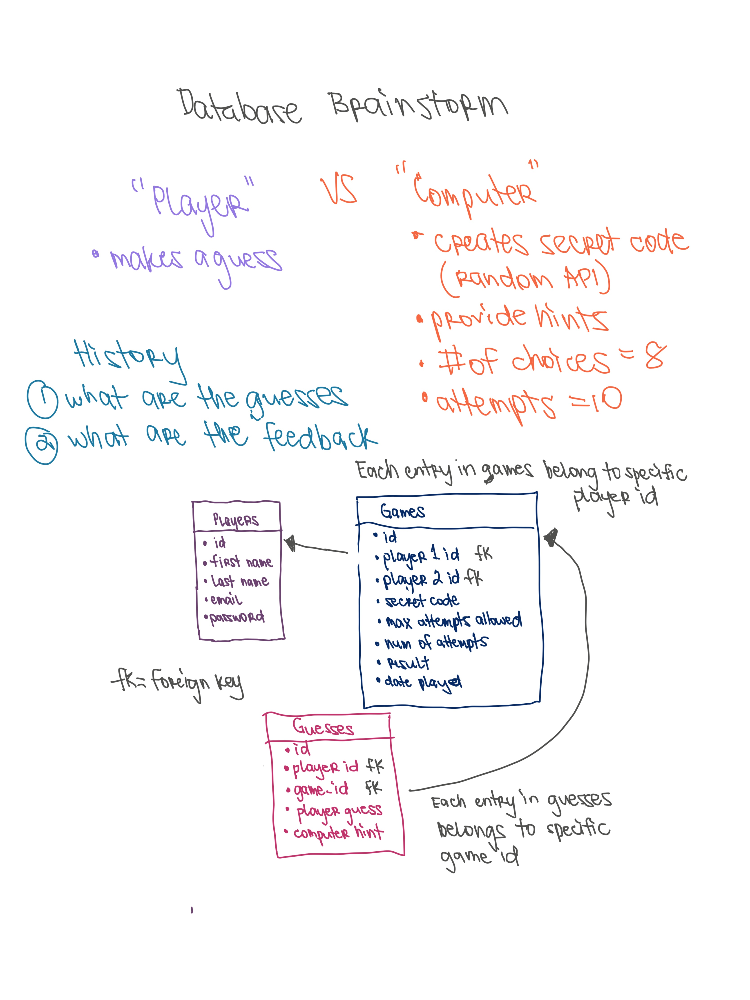
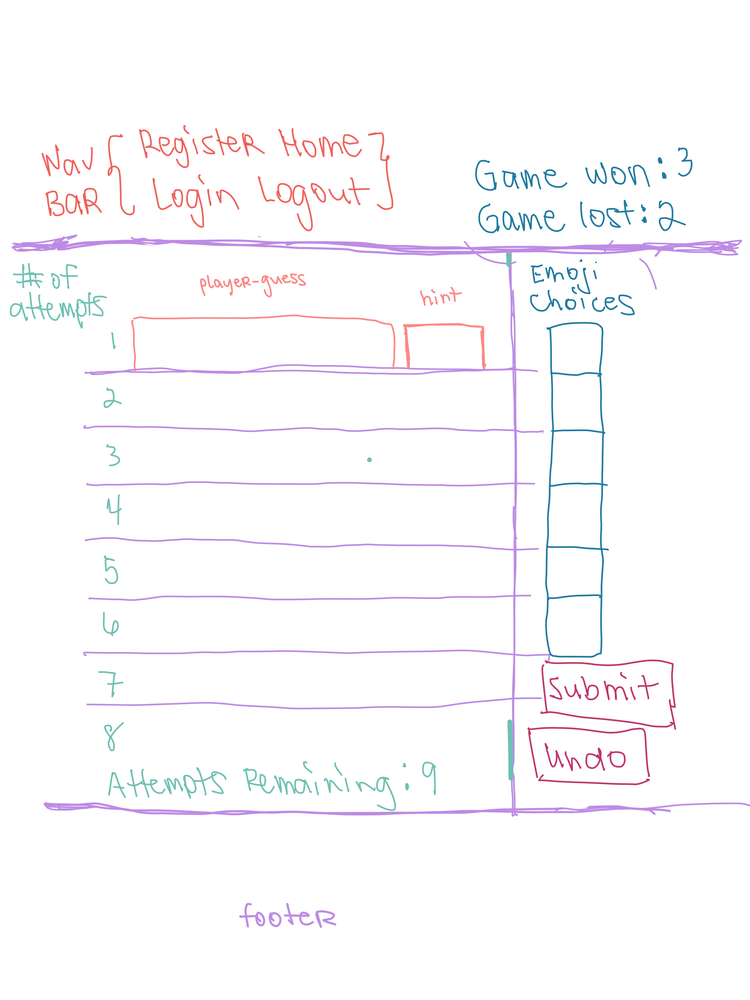

# The Mastermind Game 🤵‍♂️👰‍♀💒🔔💐❤️🥰🎊️
Can you crack the code?
[https://themastermindgame.herokuapp.com/](https://themastermindgame.herokuapp.com/)

## How to run the code.

### 1. Database

For the purposes of this demo, a SQLite db file has already been created with sample data in `mastermind.db`  
Tables created via sql in  `mastermind_tables.sql`

### 2. Environment Variables 

The `.env` file stores the secret key and database url to protect the database and any other important information.  

Place environment variables inside a file named `.env`

```
MASTERMIND_SECRET_KEY=mastermind
MASTERMIND_DATABASE_URL=sqlite:///mastermind.db
```

### 3. Build the frontend
Make sure to use the recent version of node.js

First, change directory to `frontend` the folder. Use `npm install` to install the frontend dependencies. 
Use `npm run build` to build the frontend. Change the directory back to the root of the project. 

```sh 
cd frontend
npm install
npm run build
cd ..
```

#### 4. Install all necessary requirements. 

I used the `flask` framework to develop the web application along with `sqlachemy` to communicate with the database. 
I used `flask_login_manger` to help with user authentication. 

Install the python dependencies 

```sh
pip3 intall -r requirements.txt
```

#### 5. Start the server

```sh
python3 main.py 
```

#### 6. Play the game

Open [http://127.0.0.1:5037](http://127.0.0.1:5037) in your browser


## Thought Process 

I like to start by thinking about what information needs to be stored in the database.
The database holds valuable data and acts as the brain for the entire application which will lead the direction for the rest of the code. 

I know that I want different players stored in the database so that they can keep track of their own games. Therefore, I need a `Players` table. 

I want to be able to store the secret code of the specific game. I need to be able to remember all the players' guesses so a `Guesses` table is a must. The player will be playing against the computer that will provide `hints` to the player. Hints will be stored in `Guesses` table as well. 

The tables are related to each other. Each Guess row is tied to a specific `game_id` in the `Games` table. Each Game row is tied to specific players in the `Players` table using the `player_one_id` and `player_two_id` columns.  I want to be able to display all the games of each player to show completed games or in-progress games so that players have option to review it or come back at another time.



I try to break down the problems into smaller pieces or steps. The Trello board helps me organize the tasks.
[https://trello.com/b/6k6FbbpF/mastermind-game](https://trello.com/b/6k6FbbpF/mastermind-game)

## Code Structure 
Created a `Computer Class` responsible for 
* creating the secret code via random.org api 
* comparing the player's guess to the secret code and returning the "hint". 

### Hint Code Logic

`hint = ""`
1) Each character of the guess will be compared to the character of the secret code. If it is a match, both characters will be replaced with a `None` value in the list, and add `"Y"` to the hint string  (e.g. YES - right position and right character).
2) Then loop through each guess character that is not `None` and see if the character is inside the `secret code list`. If it is, the character will be replaced with `None`, and `"M"` will be added to the hint (e.g. MAYBE - character exist but wrong position). 

### Created RESTFUL API routes in the server 
* `POST` `/games`  --> creates a brand new game 
* `GET` `/games` --> shows list of games for player 
* `GET` `/games/< int:game_id >/guesses` --> get specific game_id
* `POST` `/games/< int:game_id >/guesses` --> creates new guess 
* `POST` `/players` --> register player 
* `GET` `/login` --> login player 
* `DELETE` `/logout` --> logout player

After most http requests from the frontend, the database gets updated and stores the new data in the respective tables. 
The server then returns a response of all data needed to display in the frontend. 

### Game Interface



## Creative Extension Implemented 

* I used the randomized numbers from the random.org API as a key to a dictionary of emojis. I chose the theme wedding as an homage to a very recent special day for me. 🤵‍♂️👰‍♀💒🔔💐❤️🥰🎊️
* Players can resume games at a later time, and create multiple games
* Players are able to view scores: games won and games lost 
* Added easy, medium, difficult level by: changing the secret code length to 3, 4, or 5. 


## Creative Extensions Wishlist

* I want to add the ability for players to play against each other 
* I would love to for players to be able to choose different themes that will display different emojis for the foodie, animal lover, flags for travelers, etc. 
* Add difficulty level by: decreasing the number of max_attempts_allowed to 9 or lower. 


